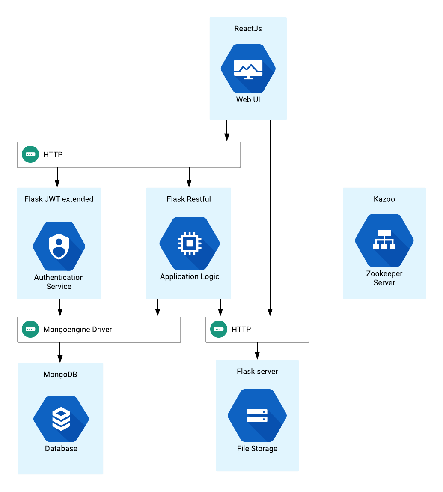

# Welcome to Cheese!
Cheese is a photo-sharing application developed as partial requirement for the "Principles for Distributed Systems" course at the Technical University of Crete.
[View Demo](https://www.youtube.com/watch?v=l4TOZ1zrVyk)

## Stack Overview

React.Js, Flask, MongoDB, Zookeeper, Docker

## Requirements

 - Docker

## Run Tests

    $make build_tests	#download & build dependencies
    $make test_all

## Run dev mode

    $make dev_build
    $make dev_run
